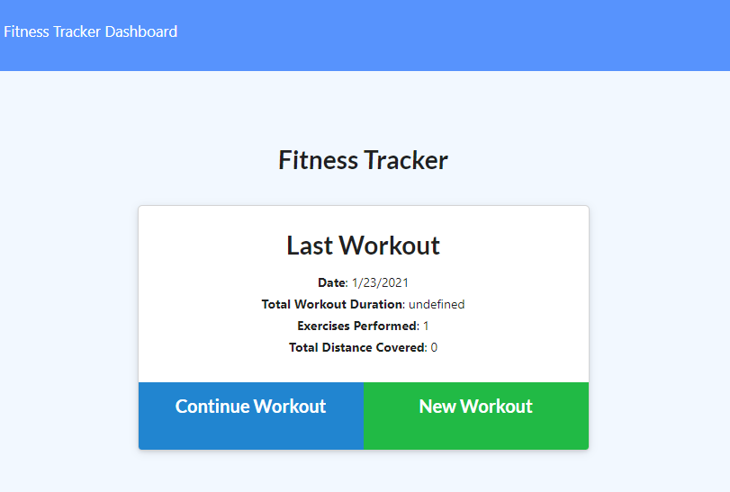
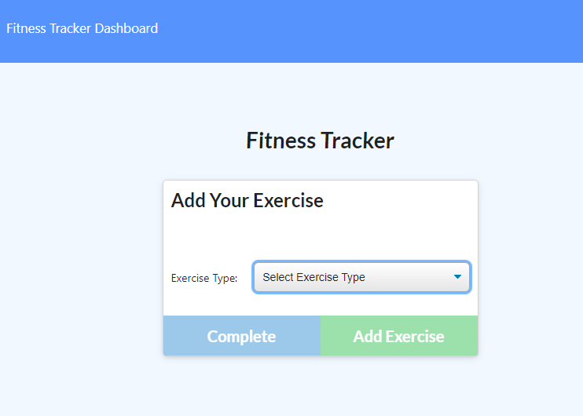
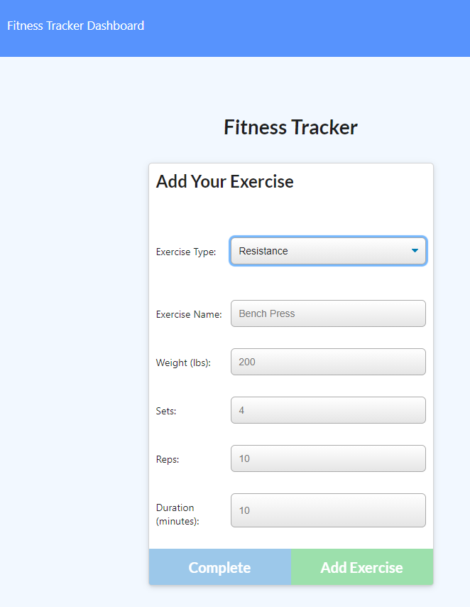
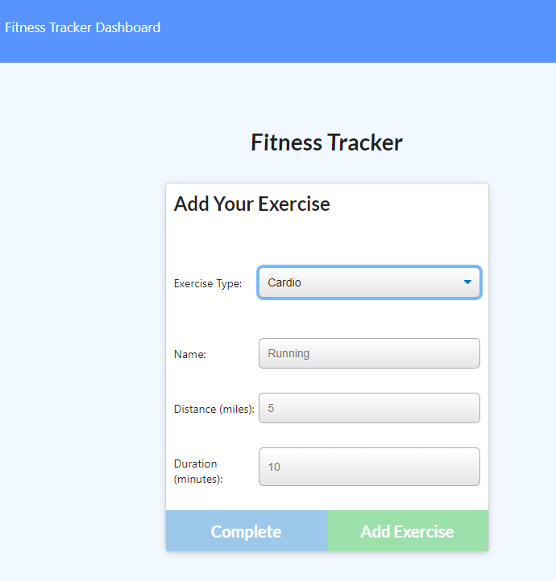
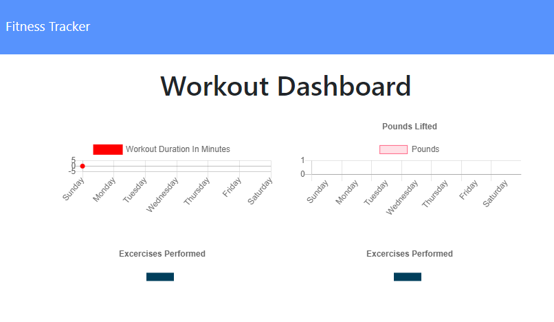

# Workout-Tracker

* Deployed URL : https://gentle-forest-35679.herokuapp.com/  
* Git repo:  https://github.com/RaihanAkter03/Workout-Tracker 

## User Story

* As a user, I want to be able to view create and track daily workouts. I want to be able to log multiple exercises in a workout on a given day. I should also be able to track the name, type, weight, sets, reps, and duration of exercise. If the exercise is a cardio exercise, I should be able to track my distance traveled.

## Installation

* To install this application, first, branch the Github Repo and clone the repo to your local machine. Then, you will need to install the node dependencies which can be done by running the npm install command in your terminal/bash shell.

After the dependencies have been installed, you will need to populate your MongoDB database by uncommenting the required seed file or by running NPM Run Seed. Once filled in, you can start the server and use the program

* Set up MongoDB Atlas database . 
* Deploy application Heroku and MongoDB Atlas.

## Usage

* Once everything has been set up, the application can be launched by running the command node server.js or npm start. You will then need to visit the local host URL for the port that you have set up for this application. Once loaded in the browser, you can either click the dashboard page to view the workout stats on the graphs provided or add/contnue a workout by clicking the buttons to add or update a new workout on the home page. When adding a new workout, ensure to click complete once you have filled everything in as if you click add exercise, then it will add a blank instance of a workout with 0 for the numbers and no string for the title/name area.

